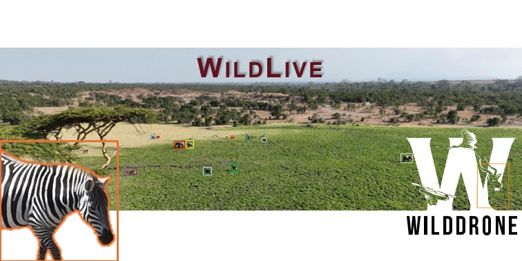

### About the Project:
We have developed an ultra-fast, multi-animal recognition and tracking method specifically designed for drones, with applications in wildlife monitoring and conservation. At the core of our hardware system is the Jetson Orin AGX that integrated into the drone to enable the deployment of advanced deep learning techniques. The software provides a dynamic, autonomous tracking system, offering conservation scientists an innovative alternative to traditional camera trap technology. The research is part of [WildDrone project](https://wilddrone.eu/)
The code is official code of the paper [*WildLive*](https://arxiv.org/abs/2504.10165)

## Table of Contents
1. [About the Project](#about-the-project)
2. [Getting Started](#getting-started)
   - [Installation on local machine](#Setup-environment-on-Local)
   - [Installation on Jetson Orin AGX](#Setup-environment-on-Jetson)
3. [Project webpage]  (https://dat-nguyenvn.github.io/WildLive/)


### Download WildTracker
```bash
git clone --recurse-submodules git@github.com:dat-nguyenvn/DC12.git
```

### Setup environment on Local
#### Docker
```bash
docker pull nvcr.io/nvidia/pytorch:23.12-py3
xhost +local:docker
docker run --gpus all --rm -it --privileged --ipc=host --ulimit memlock=-1 \
 -v /tmp/.X11-unix:/tmp/.X11-unix -e DISPLAY=$DISPLAY\
 -v /tmp/.docker.xauth:/tmp/.docker.xauth\
 -e XAUTHORITY=/tmp/.docker.xauth\
 -v /home/ah23975/mypc/2025/github/DC12:/DC12\
 --name wildlive nvcr.io/nvidia/pytorch:23.12-py3

```
* Replace `/home/boss/mypc/phd/DC12` to your **DC12 directory**


#### Depend libraries
```bash
cd /DC12
./setup.sh
```
* Mount your folder if need

```bash
cd ultralytics
pip install -e .
export PYTHONPATH=`pwd`:$PYTHONPATH
cd ..
```

```bash
cd sahi
pip install -e .
export PYTHONPATH=`pwd`:$PYTHONPATH
cd ..
```

### Run WildTracker
```bash 
python3 main.py --config ./config/default.yaml
```

### Setup environment on Jetson
#### Jetson Docker 
```bash
./docker-jetson.sh

```
#### Depend libraries
```bash
cd /DC12
./jetson_setup.sh
```


```bash
cd ultralytics
pip install -e .
export PYTHONPATH=`pwd`:$PYTHONPATH
cd ..
```

```bash
cd sahi
pip install -e .
export PYTHONPATH=`pwd`:$PYTHONPATH
cd ..
```

